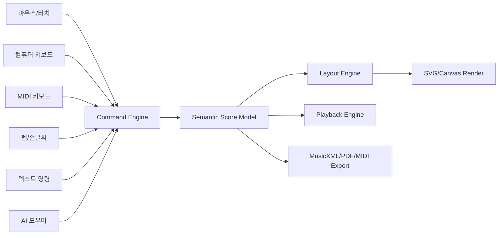
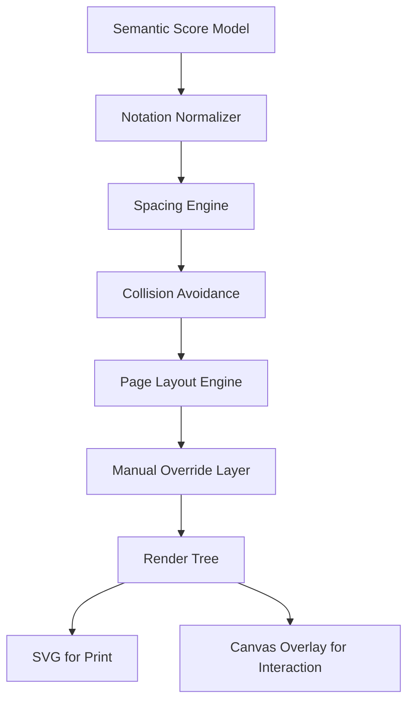
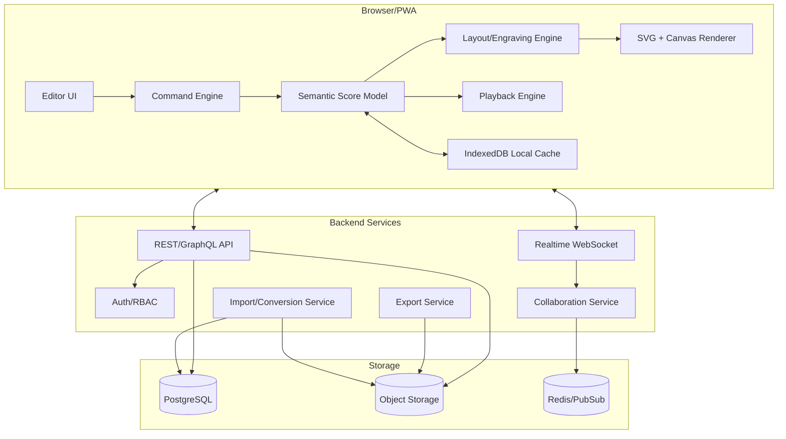

# 직관적·사용자 친화적 악보작업 웹앱 개발 계획서

**문서 버전:** v1.0  
**작성일:** 2026-05-20  
**목표:** 기존 악보 프로그램들의 장점만을 추려 웹 기반 악보작업 앱의 제품 전략, UX 설계, 기술 구조, MVP 범위, 로드맵, 리스크 관리까지 실행 가능한 개발 계획으로 정리한다.

---

## 0. 결론 요약

개발해야 할 제품은 단순한 “웹용 MuseScore”나 “협업 가능한 Dorico”가 아니다. 가장 큰 기회는 **전문 악보 품질과 초보자 친화성을 동시에 만족시키는 ‘의도 기반 악보 제작 환경’**을 만드는 데 있다.

핵심 방향은 다음과 같다.

1. **작곡가의 사고 흐름을 기준으로 UI를 설계한다.**  
   사용자는 “이 음표를 8분음표로 바꾸고, 여기에 크레셴도를 넣고, 이 파트를 Bb 클라리넷으로 이조하고 싶다”고 생각한다. 기존 프로그램처럼 도구, 모드, 팔레트, 속성 패널을 먼저 찾게 만들지 말고, 선택한 음악 요소 위에서 바로 가능한 작업을 보여주고, 명령 검색/자연어/단축키/MIDI/펜 입력이 모두 같은 내부 명령으로 귀결되게 한다.

2. **초보자에게는 ‘스케치북’, 전문가에게는 ‘출판용 조판기’가 된다.**  
   초보자는 5분 안에 8마디 멜로디와 코드, 가사를 만들 수 있어야 한다. 전문 편곡자는 연결된 파트보, 자동 레이아웃, 세밀한 수동 조정, MusicXML 왕복, 버전 비교, 출판용 PDF까지 처리할 수 있어야 한다.

3. **Dorico식 의미 기반 모델을 웹 협업 구조와 결합한다.**  
   악보는 화면에 그려진 점과 선이 아니라 `Player`, `Instrument`, `Flow`, `Voice`, `Measure`, `NotationEvent`, `Layout`의 의미 데이터로 저장한다. 이렇게 해야 파트보, 콘덴싱, 이조, MusicXML, 실시간 협업, AI 교정, 교육 과제 기능이 모두 안정적으로 확장된다.

4. **입력 방식은 “하나”가 아니라 “통합된 여러 경로”여야 한다.**  
   키보드 단축키, 마우스, MIDI 키보드, 터치/펜, 텍스트 명령, 코드 진행 도우미, 향후 음성/허밍/스캔 입력까지 모두 같은 명령 엔진에 연결한다. 사용자는 자기에게 가장 자연스러운 방식으로 입력하고, 앱은 결과를 같은 악보 모델로 정규화한다.

5. **MVP는 화려한 AI보다 ‘입력 속도 + MusicXML 호환 + 협업 기초 + 깔끔한 출력’에 집중한다.**  
   악보 앱에서 신뢰는 예쁜 랜딩 페이지가 아니라 “내 악보가 깨지지 않고, 빠르게 입력되고, 인쇄가 깔끔하고, 되돌리기가 안전한가”에서 생긴다. AI 작곡, OMR, 마켓플레이스는 v1 이후로 미루고, MVP는 핵심 편집 경험을 확실히 만든다.

---

## 1. 제품 비전

### 1.1 한 문장 비전

> **누구나 브라우저에서 빠르게 악상을 악보로 만들고, 전문가 수준으로 다듬고, 함께 편집·공유·연습할 수 있는 차세대 악보작업 웹앱.**

### 1.2 제품 철학

이 앱의 정체성은 다음 세 가지를 동시에 만족하는 것이다.

| 축 | 의미 | 구현 방향 |
|---|---|---|
| **생각의 속도** | 악상이 떠오른 순간 최대한 빨리 입력 | 빠른 노트 입력, 명령 팔레트, MIDI, 코드/리듬 패턴, 스케치 모드 |
| **출판 품질** | 인쇄 가능한 악보 품질 | 자동 조판, 충돌 회피, SMuFL 폰트, 수동 보정, 파트보 관리 |
| **협업과 학습** | 웹앱만의 장점 | 실시간 공동 편집, 댓글, 버전, 과제, 연습 모드, 링크 공유 |

### 1.3 절대 지켜야 할 UX 원칙

1. **첫 화면은 빈 오선지가 아니라 ‘작업 시작 선택지’여야 한다.**  
   예: “피아노곡 만들기”, “멜로디+코드”, “합창 4성부”, “밴드 리드 시트”, “MusicXML 가져오기”, “PDF 스캔 악보 변환은 추후” 등.

2. **선택하면 다음 행동이 보여야 한다.**  
   음표를 선택하면 길이 변경, 높낮이, 임시표, 아티큘레이션, 가사, 코드, 복사, 반복, 삭제가 근처에 뜬다. 사용자가 메뉴를 찾아 헤매지 않게 한다.

3. **전문 기능은 숨기지 말고 ‘점진적으로 드러낸다’.**  
   초보자에게 모든 옵션을 한꺼번에 보여주지 않는다. 하지만 전문가가 필요할 때는 검색, 단축키, 고급 패널로 바로 접근할 수 있어야 한다.

4. **자동 조판은 기본, 수동 조정은 예외로 남긴다.**  
   사용자가 모든 슬러·다이내믹·보표 간격을 직접 밀어야 하면 실패다. 반대로 자동 조판이 틀렸는데 고칠 수 없으면 전문가가 떠난다.

5. **웹앱이어도 ‘문서 편집기’가 아니라 ‘악기처럼 반응하는 도구’가 되어야 한다.**  
   입력 지연, 스크롤 끊김, 오디오 지연, 불안정한 Undo는 치명적이다. 성능 목표를 기능 요구사항 수준으로 관리한다.

---

## 2. 주요 악보 프로그램에서 배울 장점

아래 표는 대표 악보·디지털 악보·학습 앱의 장점을 제품 설계로 변환한 것이다. “그 기능을 그대로 복제”가 아니라, **왜 사용자가 좋아하는지**를 추출해 새 앱의 설계 원칙으로 바꾼다.

| 제품/분류 | 배울 장점 | 피해야 할 한계 | 우리 앱에 반영할 방식 |
|---|---|---|---|
| **Dorico** | 의미 기반 구조, Setup/Write/Engrave/Play/Print 같은 작업 단계, 자동 콘덴싱, 연결된 파트보, 높은 조판 품질 | 초보자에게 개념이 다소 낯설 수 있음 | 내부 데이터는 Dorico처럼 의미 기반으로 설계하되, UI는 더 부드럽고 상황형으로 만든다. 자동 파트보·자동 레이아웃을 기본 제공한다.[^dorico-features][^dorico-condensing] |
| **Sibelius** | 빠른 단축키, 데스크톱/모바일 워크플로, Cloud Sharing, 전문 사용자 기반 | 리본/메뉴 구조가 초보자에게 복잡할 수 있음 | “검색 가능한 모든 명령”과 키보드 중심 워크플로를 제공한다. 모바일·태블릿 친화 UI를 초기부터 고려한다.[^sibelius][^sibelius-mobile] |
| **Finale** | 매우 높은 수동 제어, Metatool 단축키, 사용자 정의 표현·아티큘레이션, 출판 현장의 축적된 관성 | 개발 종료, 복잡한 도구 중심 UX, 신규 사용자 진입 장벽 | 전문가용 수동 오버라이드와 사용자 정의 라이브러리는 유지하되, 도구 전환을 최소화한다. Finale 사용자의 MusicXML 마이그레이션을 중요한 유입 경로로 본다.[^finale-sunset][^finale-metatools] |
| **MuseScore Studio** | 무료/오픈소스 접근성, 쉬운 시작, MIDI 입력, MusicXML/MIDI 등 폭넓은 입출력, 커뮤니티, MuseSounds 재생 | 웹 실시간 협업과 전문 출판 워크플로는 별도 과제 | 초보자가 부담 없이 시작하는 UX, 강력한 무료 티어, MusicXML 호환, 커뮤니티 템플릿을 반영한다.[^musescore][^musescore-export][^musesounds] |
| **Flat.io** | 웹 기반, 실시간 공동 편집, 댓글, 권한 관리, 교육/LMS 통합, 브라우저·크롬북 친화성 | 전문 조판 깊이는 데스크톱 전문 앱 대비 제한 가능 | 실시간 협업과 교육 기능을 웹앱의 핵심 차별점으로 삼는다. 댓글은 악보의 의미 요소에 고정한다.[^flat-collab][^flat-edu] |
| **Noteflight** | 브라우저 기반 작성·재생·공유, 교육/마켓플레이스, 쉬운 온라인 접근 | 고급 편집·조판에서 한계가 생길 수 있음 | 공유 링크, 브라우저 온보딩, 교육 과제, 향후 합법적 악보 판매/공유 생태계 설계를 참고한다.[^noteflight][^noteflight-marketplace] |
| **StaffPad** | 펜·터치 기반 손글씨 입력, 작곡가 친화 감각, Reader를 통한 파트 동기화 | 특정 기기/펜 환경 의존 | 태블릿 사용자를 위해 손글씨/펜 입력을 v1 핵심 확장으로 설계한다. 연주자용 Reader/Practice View를 별도 경험으로 만든다.[^staffpad] |
| **Soundslice** | 실제 녹음/영상과 악보 동기화, 루프·속도 조절·이조·파트 솔로 등 연습 도구 | 본격 작곡/출판 편집 앱과는 목적이 다름 | “작성 후 연습”까지 한 앱에서 이어지도록 Practice Mode를 만든다. 악보 클릭 ↔ 오디오/비디오 위치 이동을 지원한다.[^soundslice] |
| **LilyPond** | 전통 조판 미학, 자동 engraving, 텍스트 기반 재현성, 버전 관리 친화 | WYSIWYG 초보자 경험이 약함 | 출력 엔진은 규칙 기반 조판 철학을 따른다. 고급 사용자를 위해 텍스트/스크립트 기반 내보내기 또는 style-as-code를 제공한다.[^lilypond] |
| **Hookpad** | 음악 이론 기반 코드/멜로디 제안, 색상 기반 기능화성 시각화, 작곡 초보 지원 | 전통 악보 편집 전 범위를 대체하지 않음 | 코드 진행, 스케일, 멜로디 적합도, 텐션 분석을 “작곡 도우미 패널”로 제공한다.[^hookpad] |
| **Guitar Pro / TuxGuitar** | 기타·베이스 탭, 코드 다이어그램, 플레이백, 반복 연습, 프렛 악기 중심 워크플로 | 클래식/오케스트라 악보와 UI 요구가 다름 | TAB/오선 동시 편집, 코드 다이어그램, 주법 기호를 초기부터 데이터 모델에 포함한다.[^guitarpro][^tuxguitar] |
| **forScore / Newzik** | 연주자용 악보 라이브러리, 주석, 세트리스트, 빠른 페이지 넘김, PDF→인터랙티브 악보 | 직접 작곡/편집 엔진은 제한적 | 연주자 View를 별도 설계한다. setlist, annotation, page turn, 라이브 리허설 공유를 v1 이후 확장한다.[^forscore][^newzik] |
| **MusicXML / SMuFL / MNX** | 악보 앱 간 호환, 표준 음악 폰트 매핑, 차세대 표기 포맷 논의 | MusicXML은 완벽한 레이아웃 왕복에는 한계 | MVP부터 MusicXML import/export를 핵심으로 두고, 내부 모델은 MNX/SMuFL 흐름을 고려해 장기 확장 가능하게 만든다.[^musicxml][^smufl][^w3c-music-notation][^mnx] |

---

## 3. 시장 기회와 포지셔닝

### 3.1 현재 시장의 빈틈

악보 프로그램 시장은 대체로 네 영역으로 갈라져 있다.

1. **데스크톱 전문 조판 앱**  
   Dorico, Sibelius, Finale 계열. 강력하지만 진입 장벽이 높고 협업·웹 접근성이 약하다.

2. **무료/커뮤니티 기반 앱**  
   MuseScore 계열. 접근성은 좋지만 협업, 팀 워크플로, 고급 출판 자동화에서 추가 기회가 있다.

3. **웹 기반 교육/협업 앱**  
   Flat, Noteflight 계열. 접근성과 협업은 훌륭하지만, 전문 출판 품질과 복잡한 대형 악보 처리에서 차별화 여지가 있다.

4. **연습·디지털 악보 앱**  
   Soundslice, forScore, Newzik 계열. 연주자 경험은 강하지만 작곡·편곡·조판 전체 워크플로를 대체하지 않는다.

따라서 새 앱의 포지션은 다음이어야 한다.

> **“Flat처럼 쉽게 시작하고, Dorico처럼 똑똑하게 조판하며, MuseScore처럼 부담 없이 접근하고, Soundslice처럼 연습까지 이어지는 웹 기반 악보 제작 플랫폼.”**

### 3.2 초기 타깃

초기에는 모든 전문 사용자를 한 번에 만족시키려 하면 실패할 가능성이 높다. 가장 좋은 순서는 **교육자·학생·싱어송라이터·소규모 편곡자**를 먼저 잡고, 이후 전문 출판·오케스트레이션 시장으로 확장하는 것이다.

| 우선순위 | 사용자 | 왜 중요한가 | 초기 제공 가치 |
|---|---|---|---|
| 1 | 음악 교사 / 학생 | 웹·협업·과제 니즈가 명확하고 전환 비용이 낮음 | 쉬운 작성, 과제 공유, 댓글, 재생, 템플릿 |
| 2 | 싱어송라이터 / 밴드 / 교회·동호회 편곡자 | 리드 시트, 코드, 가사, 파트 공유 수요가 큼 | 멜로디+코드+가사 빠른 입력, 이조, 파트 링크 |
| 3 | 취미 작곡가 / 유튜브 교육자 | 온라인 공유와 재생/연습 기능에 민감 | 링크 공유, 영상/오디오 동기화, 커뮤니티 템플릿 |
| 4 | 전문 편곡자 / 출판 engraver | 요구 수준이 높지만 장기 수익성이 큼 | 고급 조판, 파트보, 콘덴싱, 라이브러리, PDF 품질 |
| 5 | 앙상블 / 합창단 / 학교 밴드 | 협업·리허설·파트 배포 니즈가 큼 | 역할별 파트 보기, 주석, 버전, setlist |

### 3.3 차별화 문장

- **초보자용:** “5분 만에 첫 악보를 만들고 바로 들어보세요.”
- **교사용:** “과제, 피드백, 연주 제출을 악보 안에서 끝내세요.”
- **전문가용:** “자동 조판은 맡기고, 중요한 부분만 직접 다듬으세요.”
- **협업용:** “파일을 주고받지 말고 같은 악보에서 함께 작업하세요.”
- **연주자용:** “악보, 파트, 주석, 녹음, 연습 루프를 한 화면에서 보세요.”

---

## 4. 제품 콘셉트: “의도 기반 악보 편집기”

### 4.1 핵심 개념

기존 악보 프로그램은 대개 “도구 선택 → 위치 클릭 → 세부 조정”의 흐름을 강요한다. 새 앱은 반대로 간다.

> **음악 요소 선택 → 가능한 의도 제안 → 즉시 실행 → 자동 정리 → 필요시 세밀 조정**

예를 들어 사용자가 두 마디를 선택하면 앱은 다음과 같은 행동을 제안한다.

- 반복 기호 추가
- 한 옥타브 올리기/내리기
- 다른 악기로 복사
- 리듬 유지하고 음정만 바꾸기
- 코드 진행 추천
- 이 구간만 루프 재생
- 댓글 달기
- PDF 출력 시 줄바꿈 고정

### 4.2 세 가지 작업 레벨

| 레벨 | 사용자 상태 | UI | 예시 |
|---|---|---|---|
| **Sketch** | 악상을 빨리 기록 | 간단한 팔레트, 코드/리듬 블록, MIDI/펜 입력 | “8마디 멜로디 + 코드 + 가사” |
| **Arrange** | 파트를 나누고 구조화 | 악기/파트 패널, 이조, 반복, 섹션, 재생 | “피아노 반주를 현악 4중주로 분배” |
| **Engrave** | 인쇄·출판 마감 | 간격, 충돌, 페이지, 스타일, PDF 미리보기 | “2페이지 안에 맞추고 슬러 위치 보정” |

중요한 점은 이 세 레벨이 **강제 모드**가 아니라 **작업 맥락**이라는 것이다. 초보자는 Sketch 중심으로 시작하고, 전문가가 필요할 때 Arrange/Engrave 기능을 펼친다.

### 4.3 핵심 사용자 여정

#### 여정 A: 초보자가 첫 악보를 만드는 과정

1. 템플릿 선택: “멜로디 + 코드 + 가사”
2. 키/박자/템포 선택
3. 마우스 또는 키보드로 음표 입력
4. 코드명 입력: `C Am F G`
5. 가사 입력
6. 재생으로 확인
7. “공유 링크 만들기” 또는 “PDF 저장”

성공 기준: 사용자가 도움말을 읽지 않고 5~7분 안에 8마디 악보를 완성한다.

#### 여정 B: 교사가 과제를 내고 피드백하는 과정

1. 교사가 8마디 리듬 과제 템플릿 생성
2. 반/그룹에 배포
3. 학생이 각자 브라우저에서 작성
4. 교사는 악보 위에 직접 댓글
5. 학생은 수정 후 제출
6. 교사는 루브릭으로 평가

성공 기준: LMS 없이도 작동하고, 향후 Google Classroom/Canvas 등 LTI 통합으로 확장 가능하다.

#### 여정 C: 편곡자가 파트보를 만드는 과정

1. MusicXML 가져오기
2. 악기/연주자 매핑 확인
3. 전체 악보에서 편곡 수정
4. 파트보 자동 생성
5. 각 파트의 페이지 넘김과 리허설 마크 확인
6. 전체 PDF 또는 파트별 PDF 내보내기

성공 기준: 원본 데이터와 파트보가 분리 복사되지 않고 연결된다. 전체 악보 수정 시 파트보가 자동 갱신된다.

#### 여정 D: 연주자가 연습하는 과정

1. 파트 링크 열기
2. 주석 추가
3. 녹음 또는 영상과 동기화된 커서로 연습
4. 어려운 구간을 드래그해 루프
5. 속도 70%로 낮추고 반복
6. 교사/팀에 연주 녹음 제출

성공 기준: 악보 제작 앱이 연습 앱과 끊기지 않는다.

---

## 5. 정보 구조와 화면 설계

### 5.1 기본 화면 구조

```text
┌────────────────────────────────────────────────────────────────────┐
│ 상단: 파일명 · 저장상태 · 재생 · 공유 · 내보내기 · 명령 검색(Ctrl+K) │
├───────────────┬──────────────────────────────────────┬─────────────┤
│ 좌측 패널      │ 중앙 악보 캔버스                      │ 우측 패널    │
│ - 악기/파트    │ - 페이지/스크롤 보기                   │ - 속성       │
│ - 섹션/Flow    │ - 선택 영역 주변 미니 툴바              │ - 댓글       │
│ - 템플릿       │ - 재생 커서/입력 커서                   │ - 도우미     │
├───────────────┴──────────────────────────────────────┴─────────────┤
│ 하단: 음표 길이 · 음정 · 코드 · 가사 · 상태 · 오류/충돌 알림        │
└────────────────────────────────────────────────────────────────────┘
```

### 5.2 화면 모드

| 화면 | 목적 | 주요 기능 |
|---|---|---|
| **Create** | 악보 작성 | 음표 입력, 코드, 가사, 반복, 기본 기호 |
| **Arrange** | 구조/파트 | 악기, 이조, 파트보, 섹션, 콘덴싱 준비 |
| **Engrave** | 조판 | 간격, 페이지, 스타일, 충돌 수정, PDF 미리보기 |
| **Play** | 재생/연습 | 믹서, 루프, 템포, 오디오/비디오 동기화 |
| **Share** | 협업/교육 | 링크, 권한, 댓글, 버전, 과제, 제출 |

단, 사용자는 모드를 몰라도 된다. 상단에 “작성 / 편곡 / 조판 / 연습 / 공유” 탭을 두되, 명령 검색과 상황형 메뉴는 모든 탭에서 동작한다.

### 5.3 명령 팔레트

모든 기능은 명령 팔레트에서 검색 가능해야 한다.

예시:

- `크레셴도`
- `crescendo`
- `cresc`
- `이 부분 반복`
- `Bb 클라리넷으로 바꾸기`
- `파트보 만들기`
- `2페이지로 맞추기`
- `한 옥타브 올리기`
- `코드 붙여넣기`
- `MusicXML 내보내기`

명령 팔레트는 단순 검색창이 아니라 다음을 수행한다.

1. 현재 선택 영역을 인식한다.
2. 실행 가능한 명령만 우선 표시한다.
3. 결과를 미리보기로 보여준다.
4. 사용자의 자주 쓰는 명령을 학습해 상위 노출한다.
5. 단축키를 함께 표시해 점진적으로 전문가 워크플로로 유도한다.

### 5.4 미니 툴바

음표나 마디를 선택하면 바로 옆에 작고 빠른 툴바가 뜬다.

- 음표 길이: 온음표, 2분, 4분, 8분, 16분
- 피치: ↑ ↓, 옥타브 ↑↓
- 임시표: ♯ ♭ ♮
- 연결: 슬러, 타이, 빔
- 표현: p, mf, f, cresc, dim
- 텍스트: 가사, 코드, 연주 지시
- 구조: 반복, 복사, 삭제

### 5.5 초보자/전문가 UI 전환

| 항목 | 초보자 보기 | 전문가 보기 |
|---|---|---|
| 팔레트 | 핵심 기호만 | 전체 기호 + 사용자 라이브러리 |
| 단축키 | 화면에 힌트 표시 | 사용자 정의 단축키/매크로 |
| 속성 | 가장 자주 쓰는 값 | 모든 engraving 속성 |
| 도움말 | 단계별 가이드 | 문맥형 레퍼런스 |
| 경고 | 쉬운 설명 | 정확한 원인과 해결 옵션 |

---

## 6. 입력 시스템 설계

### 6.1 통합 명령 엔진

모든 입력은 내부적으로 같은 명령 객체로 변환한다.



이 구조의 장점은 다음과 같다.

- Undo/Redo가 안정적이다.
- 협업에서 충돌 해결이 쉬워진다.
- 단축키와 AI 명령이 같은 기능을 호출한다.
- 테스트 자동화가 쉬워진다.
- 향후 플러그인 API를 만들 수 있다.

### 6.2 음표 입력 방식

| 방식 | 대상 사용자 | 구현 우선순위 | 설명 |
|---|---|---:|---|
| 마우스 클릭 입력 | 초보자 | MVP | 오선 클릭으로 음표 입력. 길이는 하단/단축키로 선택. |
| 컴퓨터 키보드 입력 | 중급/전문가 | MVP | A-G 또는 도레미/계이름 옵션, 숫자로 길이 선택. |
| MIDI step-time 입력 | 작곡가/교육자 | MVP | Web MIDI 지원 브라우저에서 MIDI 키보드 입력. Web MIDI는 일부 브라우저에서 제한되므로 fallback 필요.[^webmidi] |
| 코드 텍스트 입력 | 리드 시트 사용자 | MVP | `Cmaj7 | Am7 D7 | G`처럼 입력. |
| 실시간 녹음 입력 | 연주자/작곡가 | v1 | 메트로놈에 맞춰 MIDI 연주 → quantize. |
| 펜/손글씨 입력 | 태블릿 사용자 | v1 | StaffPad식 자연 입력. 초기에는 리듬/피치 단순 인식부터. |
| 패턴/블록 입력 | 초보자/교육자 | v1 | 리듬 패턴, 드럼 패턴, 반주 패턴 삽입. |
| 오디오/허밍 입력 | 실험 기능 | v2 | 음정/리듬 추정 후 사용자가 확인. |
| OMR 스캔 입력 | 마이그레이션 | v2 | PDF/사진 → MusicXML 후보 생성. 전문 OMR 엔진 제휴도 고려. |

### 6.3 “리듬 먼저 / 음정 먼저” 선택

사용자마다 입력 습관이 다르다. 따라서 두 방식을 모두 지원한다.

1. **Duration-first:** 음표 길이를 고른 뒤 피치를 입력한다.  
2. **Pitch-first:** 피치를 누른 뒤 길이를 지정한다.  
3. **Hybrid:** 마지막 길이를 유지하고 피치만 연속 입력한다.

초기 설정에서 고르게 하거나, 기존 프로그램 사용자용 프리셋을 제공한다.

- MuseScore 스타일
- Sibelius 스타일
- Finale 스타일
- Dorico 스타일
- 초보자 스타일

### 6.4 코드 입력

코드 입력은 새 앱의 중요한 차별점이다. 특히 싱어송라이터, 예배팀, 밴드, 재즈 교육자에게 가치가 높다.

지원해야 할 기능:

- `C`, `Cm`, `C7`, `Cmaj7`, `C/E`, `F#dim`, `Bb13(#11)` 등 표준 코드 인식
- 한글/영문 혼합 UI
- 마디 단위 코드 붙여넣기
- 코드 진행 자동 간격 정리
- 키 변경 시 코드 자동 이조
- Nashville Number System / 로마숫자 분석 옵션
- 코드 다이어그램: 기타/우쿨렐레/피아노 보이싱
- Hookpad식 추천: 다음 코드 후보, 멜로디 적합도, 긴장도 표시

### 6.5 가사 입력

가사 입력은 많은 악보 프로그램에서 불편함이 큰 영역이다. 초기부터 별도로 잘 설계해야 한다.

요구사항:

- 한글 음절 단위 입력 지원
- 하이픈/연음/멜리스마 처리
- 여러 절 가사
- 번역 가사 줄
- 코드/가사 lead sheet 모드
- 가사 복사·붙여넣기 자동 분배
- 가사와 음표 alignment 수동 보정
- 악보 밖 가사 블록 출력

---

## 7. 조판·Engraving 설계

### 7.1 기본 원칙

조판 엔진은 다음 원칙을 따른다.

1. **의미 데이터와 표시 데이터를 분리한다.**  
   `이 음표가 C4 4분음표`라는 사실과 `화면에서 x=120, y=45`라는 배치 정보는 분리한다.

2. **자동 조판 결과 위에 수동 오버라이드를 얹는다.**  
   수동 조정은 원본을 망가뜨리는 것이 아니라 “override layer”로 저장한다. 자동 레이아웃을 다시 계산해도 사용자의 보정이 최대한 유지된다.

3. **충돌은 보이지 않는 버그가 아니라 명시적 품질 신호다.**  
   슬러, 가사, 다이내믹, 코드, 보표 간 충돌을 감지하고 “조판 품질 점수”로 표시한다.

4. **스타일은 문서가 아니라 재사용 가능한 라이브러리다.**  
   출판사, 학교, 개인의 house style을 저장하고 적용할 수 있어야 한다.

### 7.2 조판 엔진 계층



### 7.3 반드시 자동 처리해야 할 조판 요소

| 요소 | 자동 처리 | 수동 조정 |
|---|---|---|
| 음표 간격 | 박자·리듬·임시표·가사 고려 | 마디/시스템별 압축·확장 |
| 빔 | 박자 구조 기반 자동 그룹 | 빔 분리/연결/각도 |
| 슬러/타이 | 충돌 회피, 방향 자동 | 곡률, 위치, endpoint |
| 다이내믹 | 보표 아래/위 자동 배치 | 개별 위치, 그룹 정렬 |
| 가사 | 음절-음표 정렬, 멜리스마 | 세로 위치, 줄 간격 |
| 코드 | 박자 위치, 겹침 회피 | 폰트, suffix 표기, 위치 |
| 페이지 | 시스템 간격, 페이지 나눔 | 강제 줄바꿈, 프레임, 여백 |
| 파트보 | 전체 악보와 연결 | 파트별 페이지 넘김 조정 |
| 콘덴싱 | v1 이후 자동/반자동 | manual condensing override |

### 7.4 자동 콘덴싱 전략

Dorico의 자동 콘덴싱은 대형 오케스트라 악보에서 특히 강력한 개념이다. 새 앱은 MVP에서 완전 자동 콘덴싱을 목표로 하기보다 다음 단계로 접근한다.

| 단계 | 범위 | 설명 |
|---|---|---|
| MVP | 없음 또는 제한적 | 파트보와 전체 악보 연결 구조만 먼저 완성 |
| v1 | 반자동 콘덴싱 | 같은 악기 1/2 파트를 한 보표에 합치되, 사용자가 후보를 확인 |
| v1.5 | 규칙 기반 자동 콘덴싱 | 리듬 일치, 유니즌, divisi, voice 분리 규칙 적용 |
| v2 | 고급 콘덴싱 | 오케스트라 전체, 복잡한 doubling, 사용자 규칙 저장 |

### 7.5 출력 품질 목표

MVP의 출력 품질은 “전문 출판 최종본”까지는 아니어도 다음 기준은 충족해야 한다.

- PDF/SVG 출력 시 음표·기호가 선명해야 한다.
- SMuFL 호환 음악 폰트 사용을 고려한다.
- 1~4파트 리드 시트/합창/피아노/소규모 앙상블은 수동 수정 없이 읽기 좋아야 한다.
- 가사와 코드가 겹치지 않아야 한다.
- 기본 파트보가 연주 가능한 페이지 넘김을 가져야 한다.
- 마디 번호, 리허설 마크, 제목/작곡가/저작권 메타데이터가 안정적으로 출력되어야 한다.

---

## 8. 협업 설계

### 8.1 협업의 핵심 원칙

웹앱의 가장 큰 장점은 협업이다. 하지만 악보 협업은 일반 문서 협업보다 어렵다. 음표 하나의 변경이 전체 마디, 파트, 재생, 페이지 레이아웃에 영향을 주기 때문이다.

따라서 협업은 다음 원칙으로 설계한다.

1. **실시간 편집은 의미 단위로 동기화한다.**  
   “x 좌표를 바꿨다”가 아니라 “마디 12, 플루트 1, voice 1의 두 번째 8분음표 pitch를 G5로 바꿨다”를 동기화한다.

2. **댓글은 화면 좌표가 아니라 악보 객체에 붙인다.**  
   페이지가 바뀌어도 댓글이 음표/마디/파트에 남아야 한다.

3. **역할별 권한이 필요하다.**  
   작곡가, 편곡자, 교사, 학생, 연주자, 검토자, 출판 편집자의 권한이 다르다.

4. **버전 비교가 필수다.**  
   “어제 버전에서 클라리넷 파트가 어떻게 바뀌었나?”를 볼 수 있어야 한다.

### 8.2 권한 모델

| 역할 | 가능 작업 |
|---|---|
| Owner | 모든 작업, 권한 관리, 삭제 |
| Editor | 악보 편집, 댓글, 내보내기 |
| Engraver | 조판/스타일/출력 편집 |
| Commenter | 댓글, 제안, 재생 |
| Performer | 자기 파트 보기, 주석, 연습, 제출 |
| Student | 과제 악보 편집, 제출 |
| Viewer | 보기/재생만 |

### 8.3 협업 기능 단계

| 단계 | 기능 |
|---|---|
| MVP | 링크 공유, 권한, 댓글, 버전 히스토리, 자동 저장 |
| v1 | 실시간 공동 편집, presence cursor, 충돌 없는 Undo |
| v1.5 | 제안 모드, 변경 승인/거절, 브랜치/비교 |
| v2 | 리허설 모드, 실시간 파트 업데이트, 원격 합주/피드백 |

### 8.4 교육 기능

교육 시장을 고려하면 다음 기능은 강한 차별점이 된다.

- 클래스/그룹 생성
- 과제 템플릿
- 학생별 자동 복사본 생성
- 제출/재제출
- 교사 댓글과 루브릭
- 연주 녹음 제출
- 기본 이론 자동 피드백: 박자 합계, 조표 오류, 음역 초과, 병행 5도/8도 옵션
- LTI 1.3, Google Classroom, Canvas, Moodle, Microsoft Teams 통합은 v1 이후
- 학생 데이터 보호와 접근성 준수는 설계 초기부터 반영

---

## 9. 재생·오디오·연습 모드

### 9.1 재생은 “확인용”과 “표현용”을 분리한다

| 레벨 | 목적 | 기능 |
|---|---|---|
| 기본 재생 | 입력 확인 | metronome, tempo, part mute/solo, simple soundfont |
| 작곡 재생 | 악상 확인 | dynamics, articulations, humanize, mixer |
| 표현 재생 | 데모 제작 | 고품질 샘플, phrase shaping, audio export |
| 연습 재생 | 학습/연주 | loop, slow down, transpose, cursor sync, recording |

MVP에서는 기본 재생을 안정적으로 만든다. 고품질 재생은 v1에서 확장한다.

### 9.2 웹 오디오 기술

- Web Audio API 기반으로 구현한다.
- 낮은 지연이 필요한 부분은 AudioWorklet을 검토한다. AudioWorklet은 별도 오디오 스레드에서 커스텀 오디오 처리를 수행할 수 있어 저지연 처리에 유리하다.[^audioworklet]
- MIDI 입력은 Web MIDI API를 사용하되, 일부 브라우저에서 제한되므로 브라우저 호환성 안내와 fallback을 제공한다.[^webmidi]
- 고품질 오디오 export는 클라이언트 렌더링과 서버 렌더링을 병행 검토한다.

### 9.3 Practice Mode

Soundslice의 장점을 흡수해 다음을 제공한다.

- 악보 클릭 → 해당 재생 위치로 이동
- 재생 커서와 음표 하이라이트
- 구간 드래그 → loop
- 속도 조절
- 이조 연습
- 파트 mute/solo
- 메트로놈
- 오디오/비디오 동기화
- 연주 녹음 제출
- 교사용 피드백

### 9.4 연주자 View

연주자는 편집 도구가 아니라 읽기·주석·넘김·연습이 중요하다.

- 전체 UI 숨김
- 큰 악보 보기
- 빠른 페이지 넘김
- 발판 Bluetooth MIDI/keyboard support
- 주석 레이어
- 세트리스트
- 리허설 마크 탐색
- 다크 모드/무대 모드
- part update 알림

---

## 10. 기술 아키텍처

### 10.1 추천 아키텍처 요약

| 계층 | 추천 선택 | 이유 |
|---|---|---|
| Frontend | TypeScript + React 또는 Svelte | 대규모 UI, 컴포넌트 생태계, 타입 안정성 |
| Rendering | SVG + Canvas overlay | SVG는 출력 품질, Canvas는 인터랙션 성능 |
| Notation primitives | 초기 VexFlow/OSMD 참고 또는 제한 활용 | VexFlow는 브라우저에서 Canvas/SVG 악보 렌더링을 지원하고, OSMD는 MusicXML 렌더링에 강점이 있음.[^vexflow][^osmd] |
| Core engine | 자체 semantic model + layout engine | 장기적으로 편집/협업/콘덴싱/출판 품질을 위해 필요 |
| Audio | Web Audio + AudioWorklet + 샘플러 | 브라우저 내 재생과 저지연 처리 |
| Offline | IndexedDB + Service Worker | IndexedDB는 브라우저 내 대량 구조화 데이터 저장에 적합함.[^indexeddb] |
| Backend | Node.js/NestJS 또는 Go + WebSocket | 빠른 개발과 실시간 협업 |
| DB | PostgreSQL | 계정, 악보 메타, 권한, 버전 관리 |
| Object Storage | S3 호환 | PDF, audio, image, MusicXML, 샘플 파일 |
| Collaboration | CRDT(Yjs/Automerge 계열) 또는 OT | 실시간 편집과 오프라인 병합 |
| Worker/WASM | Rust/WASM 검토 | 조판 계산, MusicXML 파싱, 성능 민감 작업 |

### 10.2 전체 시스템 구조



### 10.3 왜 자체 모델이 필요한가

처음부터 완전 자체 렌더링 엔진을 만들면 시간이 많이 걸린다. 그러나 내부 데이터 모델은 반드시 자체적으로 가져가야 한다.

이유:

1. **MusicXML은 교환 포맷이지 이상적인 내부 편집 모델이 아니다.**
2. **실시간 협업은 작은 의미 단위의 operation이 필요하다.**
3. **파트보와 전체 악보를 같은 원본에서 파생해야 한다.**
4. **수동 조판 오버라이드를 원본 음악 데이터와 분리해야 한다.**
5. **AI/교정/교육 피드백은 의미 데이터를 분석해야 한다.**
6. **향후 MNX 등 차세대 표준을 흡수하려면 유연한 내부 구조가 필요하다.**

### 10.4 데이터 모델 초안

```ts
// 개념 예시. 실제 구현 시 더 세분화 필요.
type Score = {
  id: string;
  title: string;
  metadata: ScoreMetadata;
  players: Player[];
  flows: Flow[];
  layouts: Layout[];
  style: StyleProfile;
  revisions: RevisionRef[];
};

type Player = {
  id: string;
  name: string;
  instruments: Instrument[];
};

type Instrument = {
  id: string;
  name: string;
  transposition?: Transposition;
  clefs: Clef[];
  range?: PitchRange;
  notationType: 'standard' | 'tab' | 'percussion' | 'slash' | 'grand-staff';
};

type Flow = {
  id: string;
  title?: string;
  measures: Measure[];
};

type Measure = {
  id: string;
  timeSignature: TimeSignature;
  keySignature: KeySignature;
  barline?: Barline;
  eventsByStaff: Record<StaffId, Voice[]>;
};

type Voice = {
  id: string;
  events: NotationEvent[];
};

type NotationEvent =
  | NoteEvent
  | RestEvent
  | ChordSymbolEvent
  | LyricEvent
  | DynamicEvent
  | ArticulationEvent
  | DirectionEvent
  | RepeatEvent;

type Layout = {
  id: string;
  name: string;
  kind: 'full-score' | 'part' | 'lead-sheet' | 'practice';
  includedPlayers: string[];
  pageSettings: PageSettings;
  overrides: LayoutOverride[];
};
```

### 10.5 Operation 모델

협업과 Undo/Redo를 위해 모든 편집은 operation으로 기록한다.

```ts
type ScoreOperation = {
  id: string;
  userId: string;
  timestamp: string;
  baseRevision: string;
  type:
    | 'insert-note'
    | 'delete-event'
    | 'update-pitch'
    | 'update-duration'
    | 'add-lyric'
    | 'add-chord-symbol'
    | 'transpose-selection'
    | 'add-instrument'
    | 'update-layout-override'
    | 'apply-style';
  target: ScorePath;
  payload: unknown;
};
```

이 구조는 다음 기능에 직접 연결된다.

- Undo/Redo
- 버전 비교
- 협업 충돌 해결
- 변경 이력
- 자동 저장
- “제안 모드”
- AI 명령 실행 검증

---

## 11. 표준·호환성 전략

### 11.1 MusicXML

MusicXML은 악보 프로그램 간 교환의 핵심이다. MVP에서 반드시 지원해야 한다.

MVP 범위:

- MusicXML / compressed `.mxl` 가져오기
- 기본 음표, 쉼표, 박자, 조표, 가사, 코드, 다이내믹, 아티큘레이션, 슬러/타이
- 기본 악기 매핑
- PDF 출력 전 import 오류 리포트
- MusicXML 내보내기

v1 범위:

- percussion map 개선
- guitar tab 개선
- layout hints 일부 반영
- round-trip 테스트
- Finale/MuseScore/Dorico/Sibelius 주요 파일 샘플 호환 테스트

### 11.2 MIDI

MIDI는 두 가지 의미가 있다.

1. **입력 장치:** MIDI keyboard로 음표 입력
2. **파일 포맷:** 악보를 MIDI로 내보내거나 MIDI를 import

MVP에서는 MIDI 입력과 MIDI export를 우선한다. MIDI import는 리듬 quantize 정확도와 사용자 확인 UI가 필요하므로 v1로 미룬다.

### 11.3 PDF/SVG/PNG

- PDF: 인쇄/공유 핵심. 서버 렌더와 클라이언트 렌더를 모두 검토.
- SVG: 웹 표시 및 고해상도 출력에 유리.
- PNG: 썸네일, 교육 자료, SNS 공유용.

### 11.4 SMuFL

SMuFL은 음악 기호 폰트 매핑 표준이다. 새 앱은 다음을 목표로 한다.

- 기본 음악 폰트: Bravura 또는 자체/오픈 라이선스 SMuFL 폰트
- 폰트 교체 가능
- house style에 폰트 포함
- 내부 glyph reference를 SMuFL codepoint/metadata와 연결

### 11.5 MNX

MNX는 차세대 음악 표기 표준으로 논의되는 영역이다. MVP에서 직접 지원할 필요는 없지만, 내부 모델을 설계할 때 다음을 고려한다.

- MusicXML에만 종속되지 않는 의미 모델
- 시간/리듬/보이스의 명확한 표현
- 향후 MNX import/export adapter 추가 가능성

---

## 12. 접근성·국제화·한국어 대응

### 12.1 접근성 목표

웹 기반 교육/공공 시장까지 고려하면 WCAG 2.2 AA 수준을 제품 목표로 삼는 것이 좋다. WCAG 2.2는 웹 콘텐츠를 더 접근 가능하게 만들기 위한 권고를 제공하고, 장애가 있는 사용자뿐 아니라 일반 사용자에게도 사용성을 높일 수 있다.[^wcag22]

실행 항목:

- 전체 기능 키보드 조작 가능
- 포커스 표시가 가려지지 않도록 설계
- 마우스 드래그만 필요한 기능 금지: 대체 조작 제공
- 색상만으로 의미 전달 금지
- 고대비 모드
- 음표 선택/상태를 스크린리더에 전달하는 구조적 텍스트 레이어
- 자막/텍스트가 있는 튜토리얼
- 터치 타겟 크기 확보
- 모션 최소화 옵션

### 12.2 한국어 대응

한국어 사용자를 위한 기능은 글로벌 제품에서도 차별점이 될 수 있다.

- 한글 UI
- 한글 가사 음절 분배
- 계이름 입력: 도레미파솔라시 / CDEFGAB 선택
- 한국어 코드 표기 도움말
- 국악 기보는 MVP 범위 밖이지만 데이터 모델 확장 여지 확보
- 교회/합창/학교 밴드 템플릿
- 한국어 튜토리얼: “첫 악보 만들기”, “가사 넣기”, “파트보 만들기”

### 12.3 국제화

- i18n framework 초기 도입
- 모든 명령어에 alias 지원: 한국어/영어/약어
- 악보 표기 관습: 독일식 H/B, solfège, Nashville Number, roman numeral 등 확장
- 날짜/저작권/페이지 형식 현지화

---

## 13. AI 기능 전략

AI는 차별점이 될 수 있지만, 초기 핵심 편집기가 안정적이지 않으면 오히려 신뢰를 떨어뜨린다. 따라서 AI는 “작곡가를 대체하는 기능”보다 **반복 작업을 줄이고 오류를 찾는 보조 기능**으로 설계한다.

### 13.1 AI 기능 우선순위

| 단계 | 기능 | 설명 |
|---|---|---|
| MVP 후반 | 명령 해석 | “이 부분을 한 옥타브 올려줘”, “2페이지로 맞춰줘” 같은 자연어를 내부 명령으로 변환 |
| v1 | 악보 교정 | 박자 오류, 음역 초과, 겹침, 가사 누락, chord spelling 제안 |
| v1 | 코드/멜로디 도우미 | 현재 키와 멜로디에 맞는 코드 후보, 대체 진행 |
| v1.5 | 편곡 도우미 | 피아노 스케치를 현악/밴드 파트로 분배하는 후보 생성 |
| v2 | OMR/스캔 보정 | PDF/사진 인식 결과의 오류를 사용자가 검토하며 수정 |
| v2 | 스타일 정리 | “출판용으로 정리”, “재즈 리드 시트 스타일 적용” |

### 13.2 AI 안전 원칙

- 사용자의 비공개 악보를 모델 학습에 사용하지 않는 것을 기본값으로 한다.
- AI 결과는 즉시 적용하지 말고 미리보기/승인 단계를 둔다.
- 저작권 있는 곡을 무단으로 생성/복제하는 기능은 제한한다.
- 출처 불명 스타일 모방보다 일반적 음악 이론/편곡 보조에 집중한다.
- 교육 환경에서는 교사/기관 관리자가 AI 사용 범위를 제어할 수 있어야 한다.

### 13.3 AI가 특히 유용한 순간

- MusicXML import 후 깨진 부분 자동 정리
- 가사 음절 분배 오류 찾기
- 음역 초과 경고
- 조표와 임시표 spelling 제안
- 악보 안의 반복 패턴 찾기
- “이 리듬을 모든 마디에 적용” 같은 반복 작업
- “초보자용으로 쉽게 바꾸기”
- “합창 SATB로 재배치 후보 만들기”

---

## 14. MVP 범위

### 14.1 MVP 목표

MVP의 목표는 다음이다.

> **브라우저에서 1~4파트 악보를 빠르게 작성하고, 재생하고, 공유하고, PDF/MusicXML로 내보낼 수 있는 안정적인 편집기.**

### 14.2 MVP에 포함할 기능

#### A. 기본 악보 작성

- 새 악보 생성
- 템플릿: 피아노, 멜로디+코드, SATB, 현악 4중주, 밴드 리드 시트, 기타 TAB 기본
- 박자/조표/템포 설정
- 음표/쉼표 입력
- 임시표
- 타이/슬러
- 기본 아티큘레이션
- 기본 다이내믹
- 반복 기호 기본
- 마디 추가/삭제/복사
- Undo/Redo
- 선택/복사/붙여넣기

#### B. 코드·가사

- 코드 심볼 입력
- 한글/영문 가사 입력
- 여러 절 기본 지원
- 코드/가사 위치 자동 정리

#### C. 재생

- 기본 악기음 재생
- 템포
- 메트로놈
- 파트 mute/solo
- 재생 커서

#### D. 공유·협업 기초

- 클라우드 저장
- 자동 저장
- 읽기/편집 링크 공유
- 댓글
- 버전 히스토리
- PDF 미리보기

#### E. 가져오기/내보내기

- MusicXML/MXL import
- MusicXML export
- PDF export
- SVG/PNG export
- MIDI export

#### F. UX 핵심

- 명령 팔레트
- 상황형 미니 툴바
- 초보자 온보딩
- 단축키 도움말
- 모바일/태블릿 최소 대응
- 다국어 구조, 한국어/영어 우선

### 14.3 MVP에서 제외할 기능

다음은 매력적이지만 MVP에서는 제외하거나 매우 제한한다.

- 완전 자동 오케스트라 콘덴싱
- 고급 손글씨 인식
- 고급 OMR 스캔
- 실시간 공동 편집 전체 기능
- 고품질 오케스트라 샘플 라이브러리
- VST 플러그인 호스팅
- 마켓플레이스
- 복잡한 현대음악 특수기보 전체
- 국악 정간보 등 비서양 특수 기보
- AI 자동 작곡 전체 기능

### 14.4 MVP 성공 기준

| 지표 | 목표 |
|---|---:|
| 첫 악보 생성 완료 시간 | 신규 사용자 7분 이내 |
| 8마디 멜로디 입력 시간 | 숙련 사용자 2분 이내 |
| MusicXML import 성공률 | 대표 샘플 80% 이상 의미 유지 |
| PDF 출력 오류 | 핵심 템플릿에서 치명 오류 0건 |
| 자동 저장 실패 | 0.1% 미만 |
| Undo/Redo 치명 오류 | 0건 목표 |
| 편집 중 평균 프레임 | 일반 악보에서 45fps 이상 체감 |
| 사용자 만족 | 베타 NPS 30+ 목표 |

---

## 15. 상세 로드맵

### Phase 0: 리서치·프로토타입 준비, 4~6주

목표: 시장·UX·기술 리스크를 빠르게 확인한다.

작업:

- 20~30명의 사용자 인터뷰: 교사, 학생, 작곡가, 편곡자, 악보 출판 경험자
- 대표 악보 50개 수집: 피아노, 합창, 리드 시트, 기타 TAB, 현악, 관악, 간단 오케스트라
- MusicXML import 난이도 조사
- VexFlow/OSMD 기술 검증
- 자체 데이터 모델 초안 작성
- 핵심 화면 wireframe 제작
- 입력 UX 프로토타입 2~3개 비교

산출물:

- 사용자 페르소나
- 기능 우선순위
- 기술 PoC
- MVP 범위 확정

### Phase 1: 편집기 핵심 프로토타입, 8~10주

목표: 8마디~32마디 악보를 만들고 재생·출력하는 핵심 경험 검증.

작업:

- Semantic Score Model v0
- 음표/쉼표 입력
- 선택/삭제/복사/붙여넣기
- 기본 렌더링
- Undo/Redo
- 단순 PDF/SVG 출력
- 기본 재생
- 명령 팔레트 v0

성공 기준:

- 내부 팀이 5개 템플릿 악보를 만들 수 있다.
- 사용자가 음표 입력 흐름을 이해한다.
- 조판 엔진 구조의 확장 가능성을 검증한다.

### Phase 2: MVP 개발, 4~6개월

목표: Private Beta 가능한 제품.

작업:

- 계정/프로젝트/저장
- MusicXML import/export
- 코드/가사
- 댓글/공유 링크
- PDF export
- 템플릿
- 기본 스타일
- 성능 최적화
- 접근성 1차 점검
- 브라우저 호환성

성공 기준:

- 실제 교사/작곡가 베타 50~100명이 사용 가능
- 핵심 버그 triage 체계 확립
- 대표 MusicXML 파일 import 후 수정 가능

### Phase 3: Public Beta, 3개월

목표: 무료 티어로 공개하고 사용성·안정성 개선.

작업:

- 온보딩 개선
- 튜토리얼
- 사용자 피드백 루프
- 버전 히스토리 개선
- 템플릿 확장
- 교육 과제 베타
- 기본 practice mode
- 결제/플랜 설계 준비

### Phase 4: v1, 6~9개월

목표: 협업과 교육 시장에서 뚜렷한 차별점 확보.

작업:

- 실시간 공동 편집
- 교육 과제/제출
- LMS 1차 통합
- 고급 파트보
- 반자동 콘덴싱
- 손글씨 입력 베타
- 고급 재생/믹서
- 오디오/비디오 동기화 베타
- 플러그인/스크립트 초기 API

### Phase 5: v2, 12개월+

목표: 전문 편곡·출판·앙상블 시장 확장.

작업:

- 고급 engraving
- 자동 콘덴싱
- OMR/스캔
- AI 교정/편곡 도우미
- 마켓플레이스
- 출판사/팀 워크플로
- 고급 연주자 리허설 모드
- Desktop wrapper 또는 offline-first PWA 고도화

---

## 16. 팀 구성

### 16.1 초기 핵심 팀

| 역할 | 인원 | 주요 책임 |
|---|---:|---|
| Product Lead | 1 | 제품 방향, 우선순위, 사용자 인터뷰 |
| UX/Product Designer | 1 | 편집기 UX, 온보딩, 디자인 시스템 |
| Music Engraving Specialist | 1 | 조판 규칙, 악보 품질, 테스트 악보 |
| Frontend Engineer | 2 | 편집 UI, 렌더링, 상태 관리 |
| Backend Engineer | 1 | 저장, 공유, 권한, export API |
| Audio/Playback Engineer | 0.5~1 | 재생 엔진, MIDI, 오디오 |
| QA/Automation | 0.5~1 | 회귀 테스트, MusicXML 샘플, 접근성 |

초기에는 5~7명으로 시작 가능하다. 단, **악보 조판을 이해하는 도메인 전문가**는 반드시 필요하다. 일반 웹앱 개발자만으로 만들면 “작동은 하지만 음악가가 신뢰하지 않는 앱”이 될 위험이 크다.

### 16.2 v1 이후 추가 인력

- Collaboration/CRDT specialist
- Education product manager
- DevRel/plugin ecosystem 담당
- AI/ML engineer
- OMR specialist 또는 외부 파트너
- Customer success for schools
- Content/tutorial producer

---

## 17. 백로그 구조

### Epic 1: Score Model

- [ ] Player/Instrument/Flow/Measure/Voice/Event 모델 정의
- [ ] JSON schema 작성
- [ ] version migration 설계
- [ ] operation log 설계
- [ ] undo/redo stack
- [ ] selection model
- [ ] layout override model

### Epic 2: Notation Input

- [ ] 음표 길이 선택
- [ ] 피치 입력
- [ ] 쉼표 입력
- [ ] 마디 자동 채움/초과 경고
- [ ] keyboard shortcuts
- [ ] MIDI step-time
- [ ] chord symbol input
- [ ] lyric input
- [ ] copy/paste

### Epic 3: Rendering & Layout

- [ ] staff rendering
- [ ] notehead/stem/beam
- [ ] accidentals
- [ ] clef/key/time signature
- [ ] slur/tie
- [ ] dynamics
- [ ] lyrics/chords
- [ ] collision detection v0
- [ ] page layout
- [ ] responsive zoom/scroll

### Epic 4: Playback

- [ ] scheduler
- [ ] tempo/metronome
- [ ] basic instrument mapping
- [ ] mute/solo
- [ ] playback cursor
- [ ] MIDI export

### Epic 5: Import/Export

- [ ] MusicXML parser
- [ ] MusicXML mapping report
- [ ] MXL decompression
- [ ] MusicXML export
- [ ] PDF export
- [ ] SVG/PNG export

### Epic 6: Collaboration Basics

- [ ] user accounts
- [ ] project list
- [ ] autosave
- [ ] share link
- [ ] permission roles
- [ ] comments anchored to score objects
- [ ] revision history

### Epic 7: UX System

- [ ] command palette
- [ ] mini toolbar
- [ ] right property panel
- [ ] onboarding
- [ ] shortcut overlay
- [ ] empty states
- [ ] help center
- [ ] Korean/English strings

### Epic 8: Quality & Testing

- [ ] golden score corpus
- [ ] visual regression tests
- [ ] import/export round-trip tests
- [ ] playback timing tests
- [ ] accessibility tests
- [ ] browser compatibility matrix
- [ ] performance benchmarks

---

## 18. 테스트 전략

### 18.1 Golden Score Corpus

대표 악보 세트를 만들고 모든 릴리스에서 자동 비교한다.

| 카테고리 | 예시 |
|---|---|
| 단선율 | 8~32마디 멜로디, 임시표, 반복 |
| 피아노 | 양손 보표, 페달, 크로스 스태프 기본 |
| 리드 시트 | 멜로디, 코드, 가사, 반복, 1/2 ending |
| 합창 | SATB, 여러 절 가사 |
| 현악 4중주 | 파트보, 다이내믹, 슬러 |
| 관악/이조 | Bb/Eb 악기, concert/transposed view |
| 기타 | TAB + standard notation, chord diagram |
| 타악기 | 기본 percussion staff |
| 교육 | 리듬 과제, 빈 마디 채우기 |
| Import | Finale/MuseScore/Dorico/Sibelius에서 나온 MusicXML 샘플 |

### 18.2 자동 테스트

- Model unit test
- Command operation test
- Undo/Redo test
- Import/export mapping test
- Visual snapshot test
- Playback event timing test
- Layout collision test
- API permission test
- Offline save/restore test
- Accessibility keyboard navigation test

### 18.3 수동 QA 체크리스트

- 새 악보 생성부터 PDF export까지 10분 내 완료
- 악보 편집 중 Undo 50회 이상 안정성
- MusicXML import 후 사용자에게 오류/누락 안내
- 댓글 위치가 레이아웃 변경 후에도 유지
- 모바일에서 최소 보기/재생/댓글 가능
- 느린 네트워크에서 autosave 충돌 없음
- 브라우저 새로고침 후 마지막 상태 복구

---

## 19. 성능 목표

| 영역 | 목표 |
|---|---:|
| 초기 앱 로드 | 3초 이내 체감, lazy load 적용 |
| 악보 열기 | 50마디 4파트 2초 이내 |
| 편집 반응 | 100ms 이내 피드백 |
| 재생 시작 | 300ms 이내 |
| 스크롤/줌 | 45~60fps 체감 |
| autosave | 변경 후 1~3초 내 저장 표시 |
| 협업 latency | v1 기준 300ms~1s 이내 반영 |
| PDF export | 일반 악보 5초 이내, 대형 악보 서버 처리 |

성능 전략:

- 페이지/시스템 단위 virtual rendering
- layout 계산 worker 분리
- 변경된 마디/시스템만 incremental layout
- interaction overlay는 Canvas, 최종 출력은 SVG/PDF
- 대형 악보는 background pre-render
- 썸네일/cache 사용

---

## 20. 보안·프라이버시·권리 관리

### 20.1 보안 기본

- HTTPS only
- OAuth/SSO 옵션
- 역할 기반 접근 제어
- 공유 링크 만료/비밀번호 옵션
- 프로젝트 단위 권한
- 감사 로그
- API rate limiting
- Content Security Policy 적용 검토
- 민감 데이터 암호화
- 백업/복구 정책

### 20.2 교육 데이터

교육 시장을 목표로 한다면 다음을 초기 설계에 반영한다.

- 교사/학생/관리자 역할 분리
- 미성년자 데이터 최소 수집
- 학교/기관별 데이터 격리
- 보호자/기관 정책 대응
- 데이터 삭제 요청 처리
- LMS 연동 시 필요한 데이터만 전송
- 접근성 요구사항 문서화

### 20.3 저작권과 악보 공유

- 공개 공유와 비공개 공유를 명확히 구분
- 사용자가 업로드/작성한 악보의 권리 고지
- 저작권 있는 곡의 무단 배포 신고/차단 절차
- Marketplace는 MVP에서 제외하고, v2에서 권리 처리 파트너와 함께 검토
- AI 기능은 저작권 있는 악보를 무단 복제하는 방향으로 설계하지 않는다.

---

## 21. 비즈니스 모델

### 21.1 추천 플랜

| 플랜 | 대상 | 기능 |
|---|---|---|
| Free | 학생/취미 사용자 | 제한 없는 기본 작성, 공개/제한 프로젝트, 기본 export |
| Plus | 개인 작곡가 | 더 많은 비공개 악보, 고급 export, 고급 재생, 버전 히스토리 |
| Pro | 편곡자/전문가 | 고급 engraving, 파트보, house style, batch export, 플러그인 |
| Education | 교사/학교 | 클래스, 과제, 제출, LMS, 학생 관리, 개인정보/접근성 문서 |
| Team/Publisher | 앙상블/출판사 | 공동 작업공간, 승인 흐름, 브랜드 스타일, 고급 권한 |

### 21.2 초기 가격 전략

- 초반에는 Free를 넉넉하게 제공해 커뮤니티와 악보 샘플을 확보한다.
- Pro 기능은 “시간 절약”과 “출력 품질” 중심으로 과금한다.
- Education은 좌석당 과금 또는 교사+학생 번들로 설계한다.
- Marketplace 수수료 모델은 제품 신뢰와 권리 처리 체계가 자리 잡은 뒤 도입한다.

---

## 22. 리스크와 대응

| 리스크 | 심각도 | 설명 | 대응 |
|---|---:|---|---|
| 조판 엔진 난이도 | 높음 | 악보 조판은 일반 문서보다 훨씬 복잡 | MVP 범위 제한, golden corpus, engraving specialist 확보 |
| MusicXML 호환성 | 높음 | 앱마다 MusicXML 해석이 다름 | import report, 대표 앱별 테스트, round-trip 기준 명확화 |
| 실시간 협업 복잡도 | 높음 | 음표 편집 충돌이 문서 편집보다 복잡 | MVP는 댓글/버전, v1에서 CRDT/OT 단계적 도입 |
| 성능 | 높음 | 대형 악보에서 layout/render 지연 | incremental layout, worker, virtual rendering |
| Web MIDI 호환성 | 중간 | 브라우저별 지원 차이 | fallback 입력, 명확한 호환 안내 |
| 오디오 품질 | 중간 | 사용자 기대가 높아짐 | MVP는 확인용, v1에서 샘플/표현 재생 강화 |
| 초보자와 전문가 동시 만족 | 높음 | 기능이 많으면 복잡해짐 | progressive disclosure, 초보/전문 UI 전환 |
| 저작권 | 높음 | 악보 공유/AI/마켓플레이스에서 문제 | MVP는 비공개/교육 중심, 권리 정책 선제 구축 |
| 교육 개인정보 | 높음 | 학교 시장 진입 장벽 | 최소 데이터, 기관별 관리, 접근성/보안 문서 |
| 경쟁사 대응 | 중간 | 기존 앱도 웹/AI 강화 가능 | UX 속도, 협업, 교육 특화, 한국어/글로벌 틈새로 차별화 |

---

## 23. 개발 의사결정 원칙

### 23.1 직접 만들 것

- 내부 semantic score model
- command engine
- selection/operation/undo system
- collaboration-aware document model
- 핵심 UX: command palette, mini toolbar, onboarding
- layout override system

### 23.2 오픈소스/외부 기술을 활용할 것

- MusicXML parsing 참고 라이브러리
- VexFlow/OSMD: MVP 렌더링/학습/검증에 활용 가능
- SMuFL 폰트
- Web Audio/MIDI API
- CRDT 라이브러리
- PDF generation library
- OMR은 초기 자체 개발보다 제휴/외부 엔진 검토

### 23.3 절대 피할 것

- MusicXML을 내부 저장 포맷으로 그대로 쓰는 것
- 모든 기능을 한 번에 만들려는 것
- 조판 엔진 없이 “화면 좌표 편집기”로 시작하는 것
- 수동 조정을 원본 데이터에 섞어 저장하는 것
- AI 기능을 핵심 편집 안정성보다 먼저 내세우는 것
- 초보자를 위해 전문가 기능을 없애는 것
- 전문가를 위해 초보자 UI를 복잡하게 만드는 것

---

## 24. 디자인 세부 아이디어

### 24.1 “스마트 마디”

마디를 선택하면 다음 정보와 행동을 보여준다.

- 박자 합계 정상/초과/부족
- 현재 코드
- 반복 여부
- 가사 누락 여부
- 가능한 작업: 복제, 반복, 삭제, 이조, 루프, 댓글

### 24.2 “악보 건강 점수”

조판/음악 오류를 통합해 표시한다.

- 리듬 합계 오류
- 음역 초과
- 가사 누락
- 충돌
- 페이지 넘김 불량
- 파트보 누락
- MusicXML import 누락

사용자에게 “오류 7개”라고 겁주는 대신, “출력 전에 확인할 것 7개”처럼 부드럽게 표시한다.

### 24.3 “역할별 보기”

같은 악보라도 역할마다 화면이 다르다.

- Composer View: 입력/재생 중심
- Teacher View: 과제/피드백 중심
- Engraver View: 조판/스타일 중심
- Performer View: 읽기/주석/연습 중심
- Publisher View: 승인/출력/권리 중심

### 24.4 “명령 힌트 학습”

사용자가 메뉴로 기능을 실행하면 앱이 작은 힌트를 준다.

> “다음부터는 `S`를 눌러 슬러를 빠르게 추가할 수 있습니다.”

이는 Finale의 Metatool/Sibelius식 단축키 장점을 초보자 친화적으로 흡수하는 방식이다.

### 24.5 “문맥형 튜토리얼”

도움말을 별도 페이지에 숨기지 않는다.

- 사용자가 가사 입력 중이면 가사 도움말
- MusicXML import 후 오류가 있으면 import 해결 가이드
- PDF export 전 충돌이 있으면 조판 가이드
- MIDI 장치가 감지되면 MIDI 입력 가이드

---

## 25. 샘플 사용자 스토리와 인수 기준

### Story 1: 초보자가 멜로디를 입력한다

**As a** 초보 작곡가  
**I want** 마우스와 키보드로 음표를 쉽게 입력하고  
**So that** 악상을 빠르게 악보로 만들고 싶다.

인수 기준:

- 새 악보 생성 후 첫 음표 입력까지 3클릭 이하
- 음표 길이 변경이 화면에서 명확히 보임
- 마디 박자가 부족/초과될 때 즉시 안내
- 입력한 음표를 바로 재생 가능

### Story 2: 교사가 과제를 공유한다

**As a** 음악 교사  
**I want** 학생에게 악보 과제를 링크로 보내고  
**So that** 학생들이 설치 없이 제출하게 하고 싶다.

인수 기준:

- 링크 생성 가능
- 학생은 로그인 없이 보기 가능, 편집은 설정에 따라 제한
- 교사는 제출본에 댓글 가능
- 학생별 버전이 섞이지 않음

### Story 3: 편곡자가 MusicXML을 가져온다

**As a** 편곡자  
**I want** 기존 Finale/MuseScore/Dorico 파일에서 MusicXML을 가져와  
**So that** 새 앱에서 계속 작업하고 싶다.

인수 기준:

- MusicXML 업로드 후 악기 매핑 화면 표시
- 누락/불확실한 요소를 import report로 표시
- 가져온 악보를 편집하고 PDF로 내보낼 수 있음
- 최소한 음표/박자/조표/가사/코드는 유지

### Story 4: 연주자가 자기 파트만 연습한다

**As a** 연주자  
**I want** 내 파트만 크게 보고 반복 연습하고  
**So that** 리허설 전에 효율적으로 준비하고 싶다.

인수 기준:

- 파트 링크로 접속 가능
- 재생/루프/템포 조절 가능
- 주석을 추가할 수 있음
- 전체 악보 수정 후 파트가 갱신됨

### Story 5: 전문가가 조판을 다듬는다

**As a** engraver  
**I want** 자동 조판된 악보를 세밀하게 보정하고  
**So that** 출판 가능한 PDF를 만들고 싶다.

인수 기준:

- 슬러/다이내믹/가사/시스템 간격 수동 조정 가능
- 수동 조정 내역이 override로 저장됨
- 자동 레이아웃 재계산 후에도 주요 보정 유지
- PDF 출력이 화면 미리보기와 일치

---

## 26. 출시 전략

### 26.1 Private Beta

대상:

- 음악 교사 10명
- 학생/초보 작곡가 30명
- 싱어송라이터/교회 반주자/밴드 편곡자 20명
- 전문 편곡자/engraver 5명

목표:

- 첫 악보 제작 시간 측정
- 입력 UX 문제 발견
- MusicXML import 실패 유형 수집
- 조판 품질 피드백
- 교육 기능 니즈 검증

### 26.2 Public Beta

전략:

- 무료 가입
- 템플릿 중심 랜딩
- “Finale/MuseScore/Dorico에서 MusicXML 가져오기” 가이드 제공
- 한국어/영어 튜토리얼 영상
- 커뮤니티 Discord/Forum
- 학교/동아리 파일럿 프로그램

### 26.3 초기 마케팅 메시지

- “설치 없이 시작하는 악보 작업”
- “작곡, 편곡, 파트보, 연습까지 한 링크로”
- “초보자에게 쉽고, 전문가에게 깊은 웹 악보 편집기”
- “MusicXML로 기존 악보를 가져오세요”
- “가사와 코드를 가장 빠르게 입력하는 악보 앱”

---

## 27. 핵심 KPI

| 영역 | KPI | 이유 |
|---|---|---|
| 온보딩 | 첫 악보 생성 완료율 | 초보자 친화성 측정 |
| 입력 | 8마디 입력 소요 시간 | 편집기 효율 측정 |
| 유지 | 7일/30일 재방문 | 실제 작업 도구 여부 |
| 출력 | PDF export 횟수 | 실사용 가치 |
| 호환 | MusicXML import 성공률 | 전환 시장 확보 |
| 협업 | 공유 링크 생성률 | 웹앱 차별성 |
| 교육 | 과제 생성/제출 수 | 교육 시장 적합성 |
| 품질 | crash/autosave 실패율 | 신뢰성 |
| 수익 | Pro 전환율 | 전문가 가치 |
| 만족 | NPS/CSAT | 제품 방향 검증 |

---

## 28. 1년 차 개발 일정 예시

| 월 | 목표 | 주요 산출물 |
|---|---|---|
| 1 | 리서치/PoC | 사용자 인터뷰, 기술 검증, 모델 초안 |
| 2 | 편집 프로토타입 | 음표 입력, 렌더링, Undo |
| 3 | 기본 악보 작성 | 템플릿, 코드/가사 v0, 재생 v0 |
| 4 | 저장/공유 | 계정, 프로젝트, autosave, 링크 |
| 5 | Import/Export | MusicXML import/export, PDF |
| 6 | MVP 통합 | 성능, 오류 리포트, QA corpus |
| 7 | Private Beta | 베타 사용자, 피드백, 버그 수정 |
| 8 | Public Beta 준비 | 온보딩, 튜토리얼, UI 개선 |
| 9 | Public Beta | 무료 공개, 커뮤니티 운영 |
| 10 | 협업 강화 | 댓글, 버전, 권한 개선 |
| 11 | 교육 베타 | 과제, 제출, 교사 대시보드 |
| 12 | v1 계획 | 실시간 협업/고급 조판/재생 로드맵 확정 |

---

## 29. 최종 권장 개발 순서

가장 안전하고 성공 가능성이 높은 순서는 다음이다.

1. **Semantic Score Model부터 설계한다.**  
   렌더러보다 먼저 데이터 구조를 잡아야 한다.

2. **입력 UX 프로토타입을 빠르게 만든다.**  
   악보 앱의 생명은 입력 속도다. 2~3가지 입력 방식을 실제 음악가에게 테스트한다.

3. **MusicXML import/export를 MVP 핵심으로 둔다.**  
   기존 악보 자산을 가져오지 못하면 전환이 어렵다.

4. **자동 저장·Undo·버전 안정성을 기능보다 우선한다.**  
   음악가에게 악보 손실은 치명적이다.

5. **초기 조판 범위를 제한한다.**  
   피아노, 리드 시트, 합창, 소규모 앙상블을 먼저 완성한다.

6. **협업은 댓글/공유부터, 실시간 편집은 v1로 간다.**  
   실시간 편집은 어렵고 리스크가 크다. 하지만 댓글과 링크 공유만으로도 웹앱 가치를 보여줄 수 있다.

7. **AI는 편집기 안정화 후 붙인다.**  
   AI는 명령 해석, 교정, 반복 작업 자동화부터 시작한다.

8. **교육 시장을 첫 유료 성장 경로로 본다.**  
   브라우저 기반, 설치 없음, 과제/피드백은 명확한 구매 이유다.

---

## 30. 참고 자료

[^dorico-features]: Steinberg, “What Is Dorico: Discover All the Features.” https://www.steinberg.net/dorico/features/
[^dorico-condensing]: Steinberg Help, “Condensing - Dorico Pro.” https://www.steinberg.help/r/dorico-pro/6.1/en/dorico/topics/page_formatting/page_formatting_condensing_c.html
[^sibelius]: Avid, “Sibelius - Notation Software.” https://www.avid.com/sibelius
[^sibelius-mobile]: Apple App Store, “Sibelius.” https://apps.apple.com/us/app/sibelius/id1503221259
[^finale-sunset]: MakeMusic Help Center, “Finale Sunset FAQ.” https://makemusic.zendesk.com/hc/en-us/articles/25843888130839-Finale-Sunset-FAQ
[^finale-metatools]: Finale 2014 Quick Reference Guide for Windows, keyboard shortcuts/metatools section. https://noty-bratstvo.org/sites/default/files/Finale%202014%20Quick%20Reference%20Guide%20for%20Windows%20.pdf
[^musescore]: MuseScore, “Free music composition and notation software.” https://musescore.org/
[^musescore-export]: MuseScore Handbook, “File export.” https://handbook.musescore.org/file-management/file-export
[^musesounds]: MuseScore Handbook, “MuseSounds.” https://handbook.musescore.org/sound-and-playback/musesounds
[^flat-collab]: Flat.io, “Online collaborative music notation software.” https://flat.io/collaboration
[^flat-edu]: Flat for Education. https://flat.io/edu
[^noteflight]: Noteflight, “Online Music Notation Software.” https://www.noteflight.com/
[^noteflight-marketplace]: Noteflight Marketplace, “Selling and Purchasing.” https://www.noteflight.com/marketplace-selling-and-purchasing
[^staffpad]: StaffPad. https://www.staffpad.net/
[^soundslice]: Soundslice. https://www.soundslice.com/
[^hookpad]: Hooktheory, “Hookpad Songwriting Software.” https://www.hooktheory.com/hookpad
[^lilypond]: LilyPond. https://lilypond.org/
[^guitarpro]: Guitar Pro. https://www.guitar-pro.com/
[^tuxguitar]: TuxGuitar. https://www.tuxguitar.app/
[^forscore]: forScore. https://forscore.co/
[^newzik]: Newzik. https://newzik.com/en
[^musicxml]: W3C CG MusicXML repository. https://github.com/w3c-cg/musicxml
[^smufl]: SMuFL, “Standard Music Font Layout.” https://www.smufl.org/
[^w3c-music-notation]: W3C Music Notation Community Group. https://www.w3.org/community/music-notation/
[^mnx]: W3C MNX specification. https://w3c.github.io/mnx/docs/
[^vexflow]: VexFlow. https://www.vexflow.com/
[^osmd]: OpenSheetMusicDisplay TypeScript Library. https://opensheetmusicdisplay.org/typescript-library/
[^webmidi]: MDN Web Docs, “Web MIDI API.” https://developer.mozilla.org/en-US/docs/Web/API/Web_MIDI_API
[^audioworklet]: MDN Web Docs, “AudioWorklet.” https://developer.mozilla.org/en-US/docs/Web/API/AudioWorklet
[^indexeddb]: MDN Web Docs, “IndexedDB API.” https://developer.mozilla.org/en-US/docs/Web/API/IndexedDB_API
[^wcag22]: W3C, “Web Content Accessibility Guidelines (WCAG) 2.2.” https://www.w3.org/TR/WCAG22/

---

## 31. 부록: MVP 기능 우선순위 매트릭스

| 기능 | 사용자 가치 | 개발 난이도 | MVP 여부 | 메모 |
|---|---:|---:|---|---|
| 기본 음표 입력 | 매우 높음 | 중간 | 포함 | 제품의 중심 |
| 코드 입력 | 높음 | 중간 | 포함 | 리드 시트 시장 핵심 |
| 가사 입력 | 높음 | 중간 | 포함 | 한국어 대응 중요 |
| MusicXML import | 매우 높음 | 높음 | 포함 | 전환 사용자의 핵심 |
| PDF export | 매우 높음 | 중간 | 포함 | 실사용 필수 |
| 기본 재생 | 높음 | 중간 | 포함 | 입력 확인용 |
| 댓글/공유 | 높음 | 중간 | 포함 | 웹앱 차별점 |
| 실시간 협업 | 매우 높음 | 매우 높음 | 제외 | v1 |
| 손글씨 입력 | 중간~높음 | 매우 높음 | 제외 | v1 |
| OMR 스캔 | 높음 | 매우 높음 | 제외 | v2/제휴 |
| 자동 콘덴싱 | 전문가 가치 높음 | 매우 높음 | 제외 | v1.5~v2 |
| AI 작곡 | 홍보 가치 높음 | 높음 | 제외 | 편집 안정 후 |
| 교육 과제 | 높음 | 중간 | 제한/베타 | v1에서 강화 |
| Marketplace | 중간 | 높음 | 제외 | 권리 처리 필요 |
| 플러그인 API | 전문가 가치 높음 | 높음 | 제외 | v1.5 |

---

## 32. 부록: 개발 초기에 만들면 좋은 데모 5개

1. **멜로디+코드+가사 8마디 데모**  
   초보자 온보딩과 입력 속도를 검증한다.

2. **MusicXML import 데모**  
   MuseScore/Finale/Dorico에서 export한 MusicXML을 가져와 편집하고 PDF로 출력한다.

3. **교사용 과제 데모**  
   교사가 리듬 과제를 만들고 학생이 제출하고 교사가 댓글을 다는 흐름을 보여준다.

4. **파트보 자동 생성 데모**  
   현악 4중주 전체 악보에서 바이올린/비올라/첼로 파트를 자동 생성한다.

5. **Practice Mode 데모**  
   악보를 재생하고 특정 구간을 루프하며 템포를 낮춰 연습한다.

이 다섯 데모가 설득력 있게 작동하면 제품의 핵심 가치를 외부 사용자와 투자자, 교육기관, 개발팀 모두에게 명확히 보여줄 수 있다.

---

## 33. 한 줄 최종 제안

**처음 1년은 “웹에서 가장 쓰기 쉬운 MusicXML 호환 악보 편집기”를 완성하고, 그다음 1년은 “협업·교육·연습·전문 조판까지 이어지는 악보 작업 플랫폼”으로 확장한다.**
